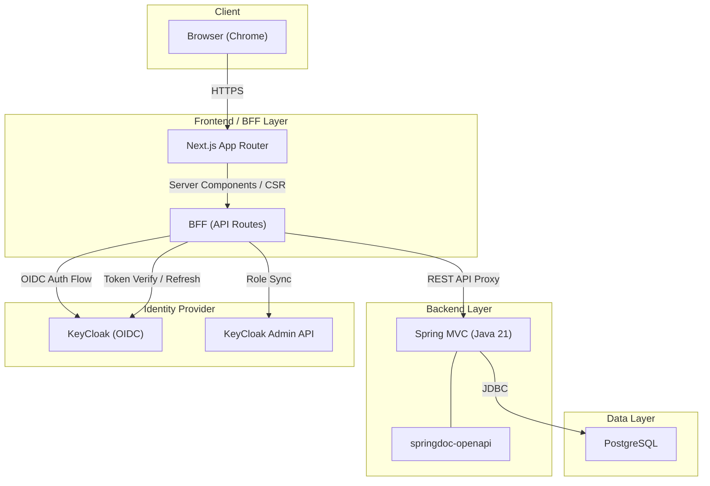
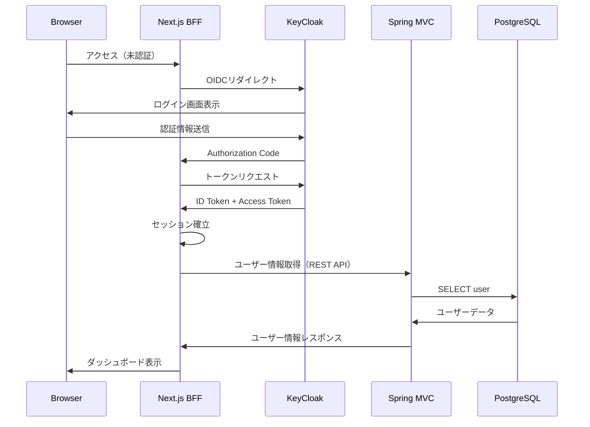
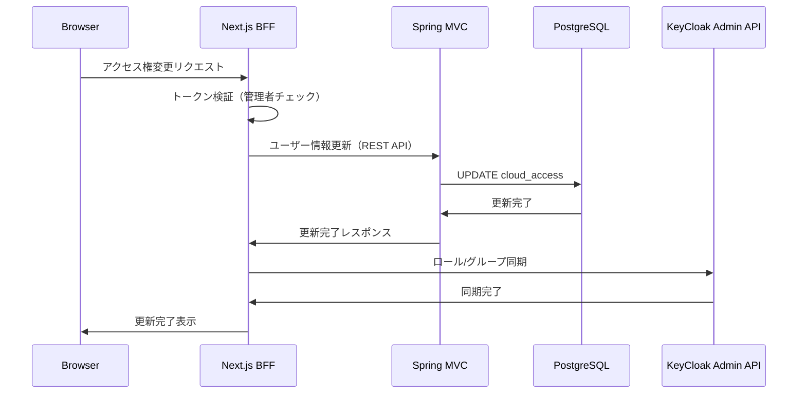

# システム構成図

## 全体アーキテクチャ

## シーケンス図: ログインフロー

## シーケンス図: アクセス権変更フロー

## 技術選定根拠

| カテゴリ | 選定技術 | 選定理由 | 却下した代替案 |
|---------|---------|---------|---------------|
| フロントエンド/BFF | Next.js 14+ (App Router) | ユーザー指定。Server Components対応、BFF統合が容易 | Pages Router（レガシー） |
| UIライブラリ | shadcn/ui + Tailwind CSS | 軽量、カスタマイズ性高、App Router親和性 | MUI（重量級）、Ant Design（バンドルサイズ大） |
| バックエンド | Spring MVC (Java 21 LTS) | ユーザー指定。Virtual Threads、最新LTS | Java 17（旧世代） |
| DB | PostgreSQL | ユーザー指定。OSS、実績豊富 | MySQL |
| IdP連携 | KeyCloak OIDC | ユーザー指定。モダン、Next.js親和性高 | SAML 2.0（実装複雑） |
| BFF-Backend通信 | REST API | シンプル、標準的、学習コスト低 | gRPC（過剰） |
| APIドキュメント | springdoc-openapi | Spring Boot統合、自動生成 | 手動管理（保守コスト高） |
