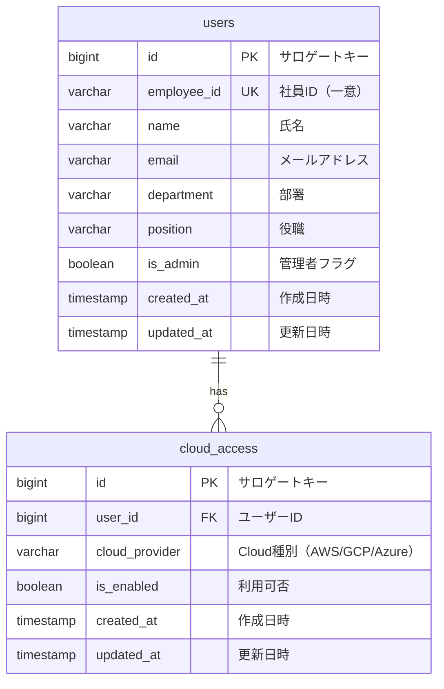

# ER図

## データベース設計

## テーブル定義

### users テーブル

| カラム名 | 型 | 制約 | 説明 |
|---------|------|------|------|
| id | BIGSERIAL | PK | サロゲートキー |
| employee_id | VARCHAR(50) | UNIQUE, NOT NULL | 社員ID |
| name | VARCHAR(100) | NOT NULL | 氏名 |
| email | VARCHAR(255) | NOT NULL | メールアドレス |
| department | VARCHAR(100) | | 部署 |
| position | VARCHAR(100) | | 役職 |
| is_admin | BOOLEAN | NOT NULL, DEFAULT false | 管理者フラグ |
| created_at | TIMESTAMP | NOT NULL, DEFAULT NOW() | 作成日時 |
| updated_at | TIMESTAMP | NOT NULL, DEFAULT NOW() | 更新日時 |

### cloud_access テーブル

| カラム名 | 型 | 制約 | 説明 |
|---------|------|------|------|
| id | BIGSERIAL | PK | サロゲートキー |
| user_id | BIGINT | FK(users.id), NOT NULL | ユーザーID |
| cloud_provider | VARCHAR(20) | NOT NULL | Cloud種別（AWS/GCP/Azure） |
| is_enabled | BOOLEAN | NOT NULL, DEFAULT false | 利用可否 |
| created_at | TIMESTAMP | NOT NULL, DEFAULT NOW() | 作成日時 |
| updated_at | TIMESTAMP | NOT NULL, DEFAULT NOW() | 更新日時 |

**ユニーク制約**: `cloud_access(user_id, cloud_provider)` の複合ユニーク

### 初期データ

DBのデータは別システムから連携される前提。初期データとして以下のシードデータを投入する:

- 管理者ユーザー 1名
- 一般社員ユーザー 数名
- 各ユーザーにAWS/GCP/Azureのcloud_accessレコード
