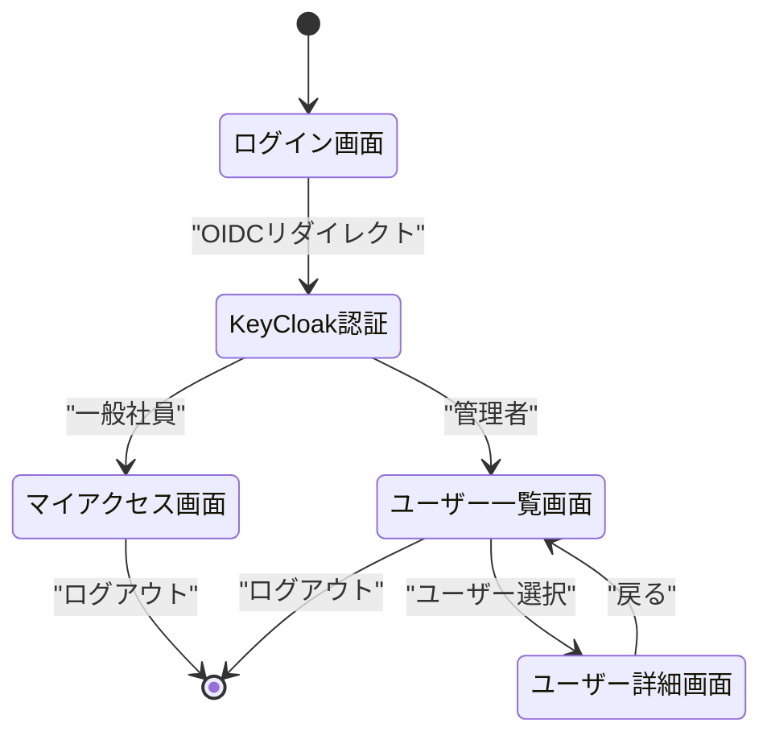
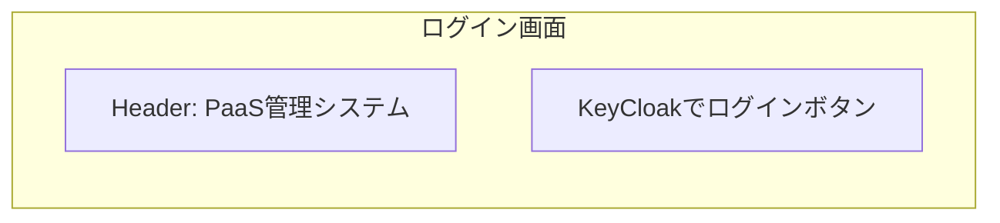
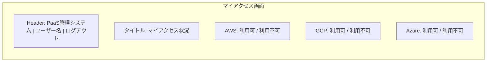
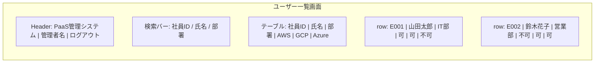
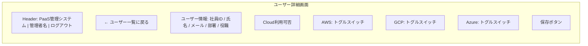

# 画面一覧・遷移図

## 画面一覧

| # | 画面名 | URL | ロール | 説明 |
|---|--------|-----|--------|------|
| 1 | ログイン画面 | /login | 全員 | KeyCloakへのOIDCリダイレクト |
| 2 | マイアクセス画面 | /my-access | 一般社員 | 自分のCloud利用可否状況を閲覧 |
| 3 | ユーザー一覧画面 | /admin/users | 管理者 | ユーザー一覧表示・検索 |
| 4 | ユーザー詳細画面 | /admin/users/[id] | 管理者 | ユーザー詳細・Cloud利用可否の編集 |

## 画面遷移図

## 画面ワイヤーフレーム

### ログイン画面

### マイアクセス画面（一般社員）

### ユーザー一覧画面（管理者）

### ユーザー詳細画面（管理者）

